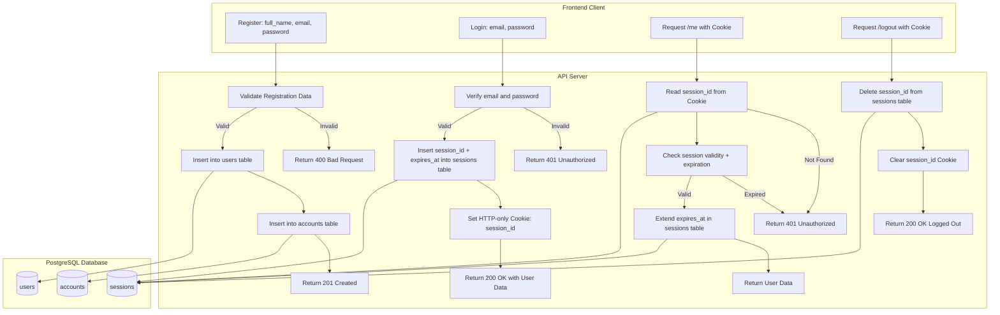

# 🌐 Session-Based Authentication with Express and TypeScript (PostgreSQL)

A simple Node.js application demonstrating **custom session-based authentication** using **Express**, **TypeScript**, and **PostgreSQL**. User sessions are manually stored in the database for full control and flexibility.

---

## 🚀 Features

- ✅ User registration and login
- 🍪 Custom session management (no `express-session`)
- 🔐 HTTP-only Cookies for session tracking
- ⏳ Session expiration with auto-extension on user activity
- 🧠 TypeScript for type safety
- 📁 Organized project structure
- 🌱 Environment variable support (`dotenv`)

---

## 🛠 Tech Stack

- Node.js
- Express.js
- TypeScript
- PostgreSQL
- dotenv

---

## 📦 Installation

```bash
git clone https://github.com/your-username/session-auth-postgres.git
cd session-auth-postgres
npm install

```

### Flowchart


