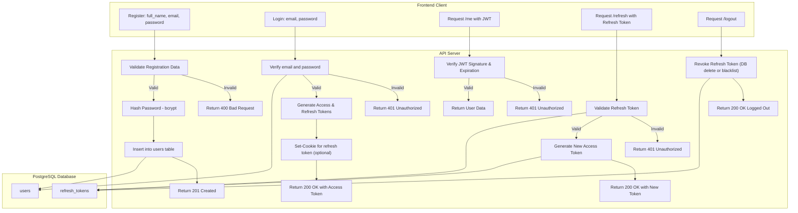

# 🪪 Token-Based Authentication with Express and TypeScript

A simple Node.js application demonstrating **token-based authentication** using **Express**, **TypeScript**, and **PostgreSQL**. Tokens (JWT) are used for stateless authentication.

---

## 🚀 Features

- ✅ User registration and login
- 🔐 Token-based authentication using **JWT (JSON Web Tokens)**
- 🧠 TypeScript for type safety
- 📁 Organized project structure
- 🌱 Environment variable support (`dotenv`)

---

## 🛠 Tech Stack

- Node.js
- Express.js
- TypeScript
- PostgreSQL
- JWT (`jsonwebtoken`)
- bcrypt

---

## 📦 Installation

```bash
git clone https://github.com/your-username/token-auth-example
cd token-auth-example
npm install
cp .env.example .env
npm run dev
```

🔑 Token-Based Authentication (with JWT + PostgreSQL)
🗺️ Flowchart
🧑‍💻 Token-Based Auth Flow (Register, Login, Access, Refresh)


