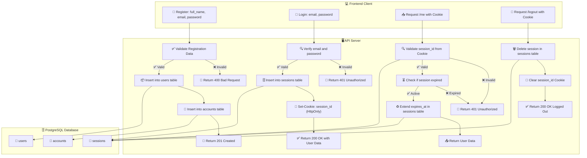

# 🌐 Session-Based Authentication with Express and TypeScript (PostgreSQL)

A simple Node.js application demonstrating **custom session-based authentication** using **Express**, **TypeScript**, and **PostgreSQL**. User sessions are manually stored in the database for full control and flexibility.

---

## 🚀 Features

- ✅ User registration and login
- 🍪 Custom session management (no `express-session`)
- 🔐 HTTP-only Cookies for session tracking
- ⏳ Session expiration with auto-extension on user activity
- 🧠 TypeScript for type safety
- 📁 Organized project structure
- 🌱 Environment variable support (`dotenv`)

---

## 🛠 Tech Stack

- Node.js
- Express.js
- TypeScript
- PostgreSQL, Mysql, MongoDB
- dotenv

---

## 📦 Installation

```bash
git clone https://github.com/jordantanaliga100/sessionBasedAuth
cd sessionBasedAuth
npm install
```

🌐 Session-Based Authentication (with Cookies + PostgreSQL)
🗺️ Flowchart
🧑‍💻 Session-Based Auth Flow (Register, Login, Me, Logout)



### 🉐 Docker-Based Dev Setup

> This 👇

🔥 POSTGRESQL
docker run -d \
 --name mysql-con \
 -e MYSQL_ROOT_PASSWORD=secret \
 -e MYSQL_DATABASE=mydb \
 -e MYSQL_USER=admin \
 -e MYSQL_PASSWORD=secret \
 -p 3306:3306 \
 mysql

🔥 POSTGRESQL
docker run -d \
 --name postgres-con \
 -e POSTGRES_DB=mydb \
 -e POSTGRES_USER=admin \
 -e POSTGRES_PASSWORD=secret \
 -p 5432:5432 \
 postgres

🔥 MONGODB
docker run -d \
 --name mongo-con \
 -e MONGO_INITDB_ROOT_USERNAME=admin \
 -e MONGO_INITDB_ROOT_PASSWORD=secret \
 -e MONGO_INITDB_DATABASE=mydb \
 -p 27017:27017 \
 mongo

> or This 👇

```sh
> docker-compose -p app up -d
> docker-compose down
```
